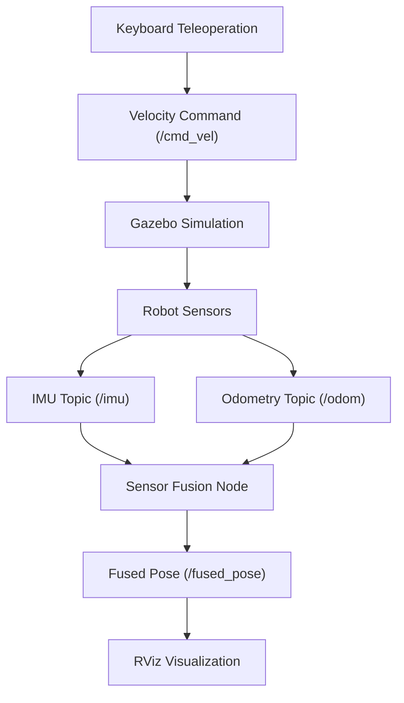
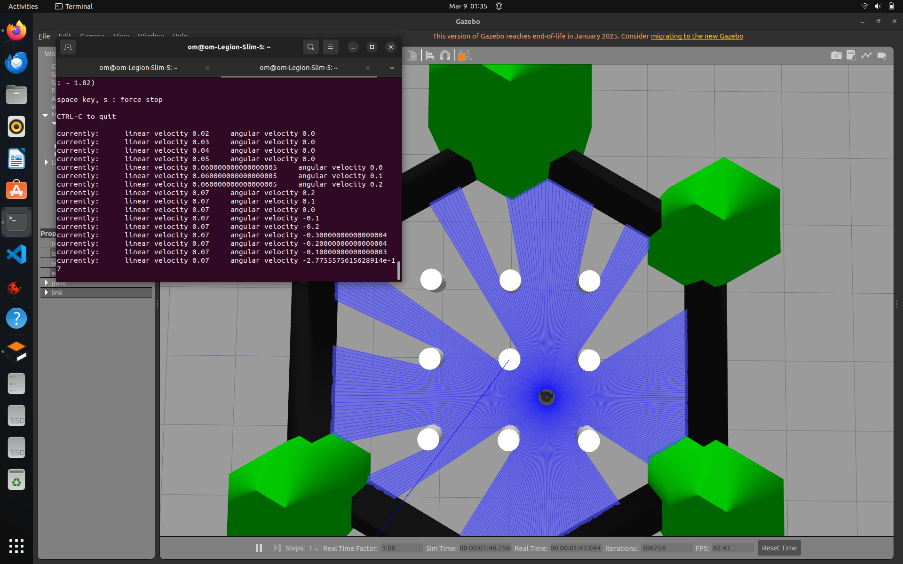
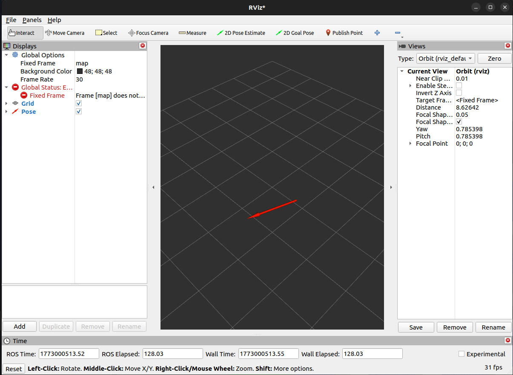

# Multi-Sensor Robot Localization using ROS2


This project implements a ROS2-based robot localization pipeline that fuses IMU and odometry data to estimate the robot pose in a simulated environment.

The system is built using **C++**, runs in **Gazebo simulation**, and visualizes robot pose in **RViz**.

---

# System Overview

Robots rely on multiple sensors to estimate their position and orientation.

This project demonstrates a basic **sensor fusion pipeline** where:

- IMU provides orientation and angular velocity
- Odometry provides wheel-based position estimates
- A fusion node estimates the robot pose

The estimated pose is published as `/fused_pose`.

---

# System Architecture



---

# Demo

## Gazebo Simulation

The robot runs in a Gazebo simulation environment and receives sensor data from IMU and wheel odometry.



---

## RViz Visualization

The fused robot pose is visualized in RViz using the `/fused_pose` topic.



---

# Features

- ROS2 C++ node architecture
- Multi-sensor data processing
- Real-time robot pose estimation
- Gazebo robot simulation
- RViz visualization support
- Teleoperation control for testing
- Modular ROS2 publisher/subscriber design

---

# Technologies Used

- ROS2 Humble
- C++
- Gazebo Simulator
- RViz
- ROS2 Topics
- Sensor Fusion Concepts

---

# Project Structure

```
multi_sensor_navigation
│
├── CMakeLists.txt
├── package.xml
├── include
│
└── src
    ├── sensor_listener.cpp
    └── ekf_fusion_node.cpp
```

---

# ROS Topics Used

| Topic | Description |
|------|-------------|
| /imu | IMU sensor data |
| /odom | Wheel odometry |
| /fused_pose | Estimated robot pose |
| /cmd_vel | Velocity commands |

---

# Prerequisites

Before running the project ensure:

- Ubuntu 22.04
- ROS2 Humble
- Gazebo
- TurtleBot3 simulation packages

Install dependencies:

```bash
sudo apt update
sudo apt install ros-humble-turtlebot3*
sudo apt install ros-humble-gazebo-ros-pkgs
sudo apt install ros-humble-rviz2
```

---

# Installation

Clone the repository into a ROS2 workspace.

```bash
mkdir -p ~/auv_ws/src
cd ~/auv_ws/src

git clone https://github.com/yourusername/multi_sensor_navigation.git
```

Build the workspace:

```bash
cd ~/auv_ws
colcon build
```

Source the workspace:

```bash
source install/setup.bash
```

---

# Running the Project

## 1 Launch Gazebo Simulation

```bash
source /opt/ros/humble/setup.bash
export TURTLEBOT3_MODEL=burger
ros2 launch turtlebot3_gazebo turtlebot3_world.launch.py
```

---

## 2 Run Sensor Fusion Node

```bash
source /opt/ros/humble/setup.bash
source ~/auv_ws/install/setup.bash
ros2 run multi_sensor_navigation ekf_fusion
```

---

## 3 Control the Robot

```bash
ros2 run turtlebot3_teleop teleop_keyboard
```

Keyboard controls:

```
w → forward
s → backward
a → turn left
d → turn right
```

---

## 4 Monitor Fused Pose

```bash
ros2 topic echo /fused_pose
```

Example:

```
x: -1.92
y: -0.45
theta: 0.12
```

---

# Visualizing Pose in RViz

Launch RViz:

```bash
rviz2
```

Set:

```
Fixed Frame → map
```

Add:

```
Pose → /fused_pose
```

---

# Example Workflow

Terminal 1 → Gazebo simulation  
Terminal 2 → EKF fusion node  
Terminal 3 → teleop keyboard control  
Terminal 4 → ros2 topic echo /fused_pose  

---

# Future Improvements

- Full Extended Kalman Filter implementation
- Trajectory visualization in RViz
- Integration with ROS2 Navigation2 stack
- Obstacle avoidance

---

# Author

Om Pratap Tilwar  
B.Tech Electronics and Communication Engineering (IoT)  
Indian Institute of Information Technology Nagpur  

GitHub: https://github.com/omtilwar
